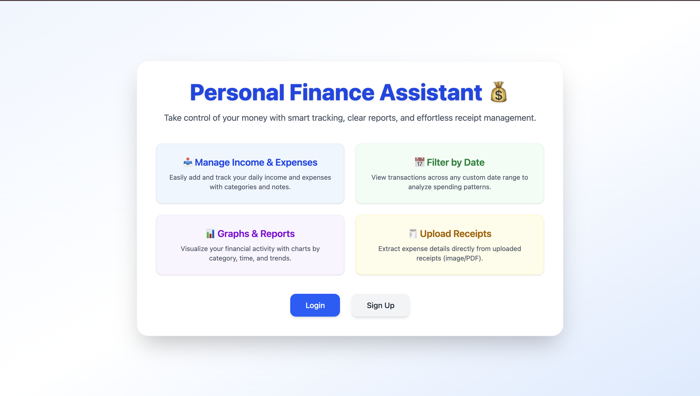
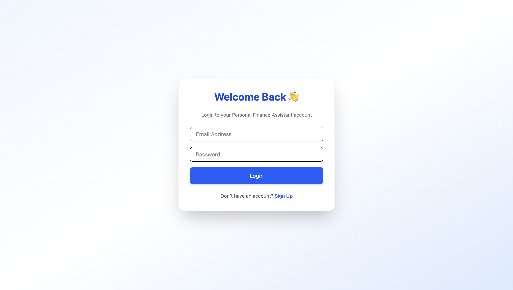
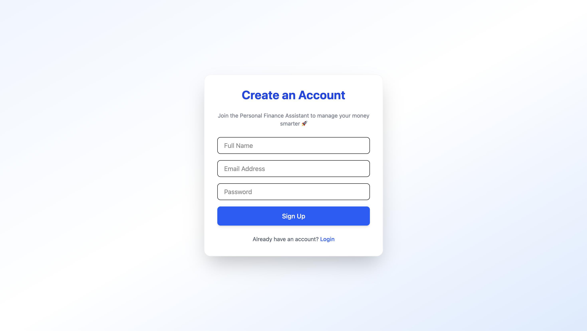
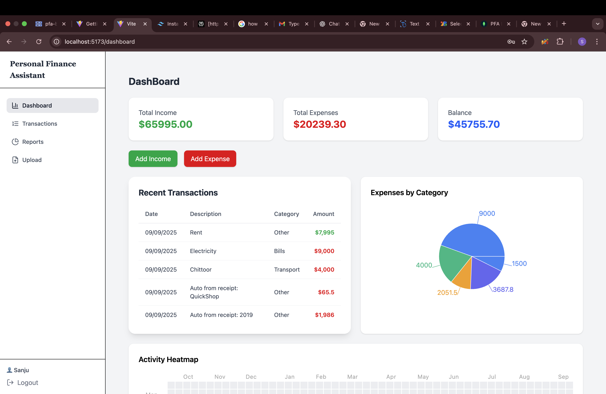
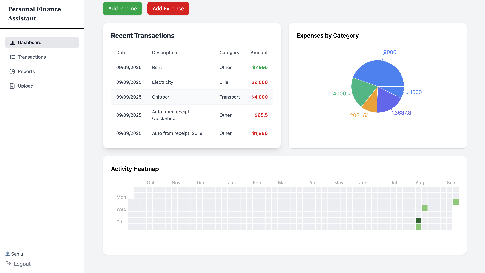
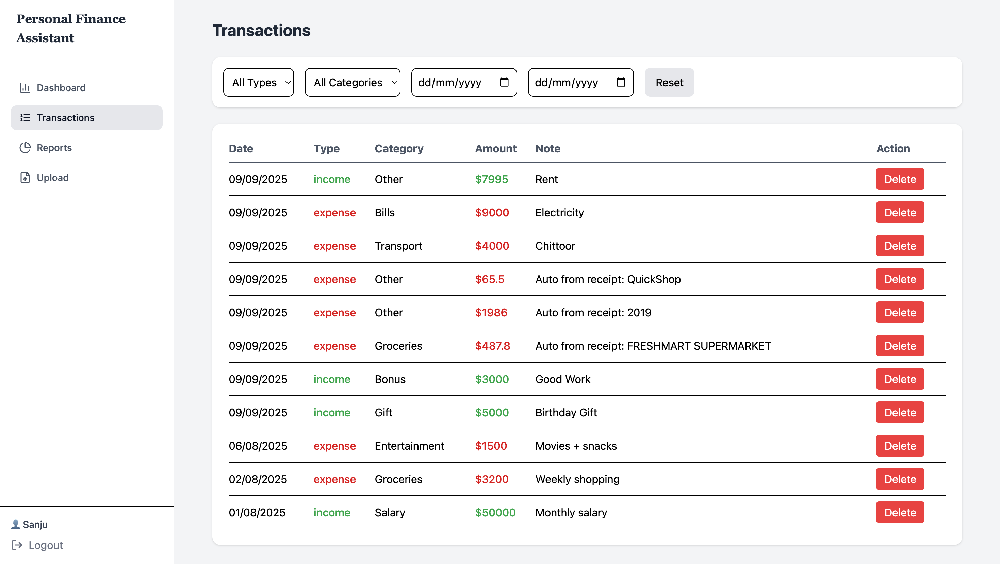
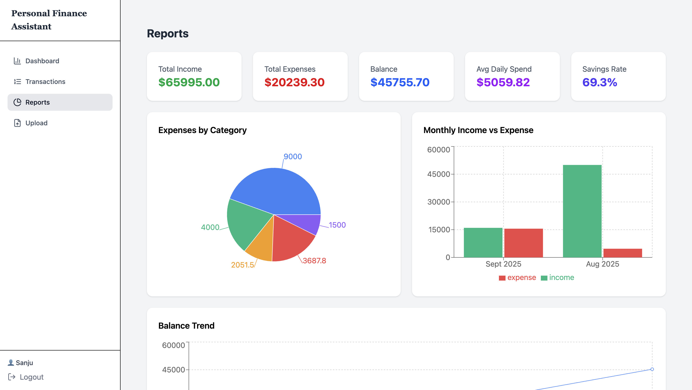
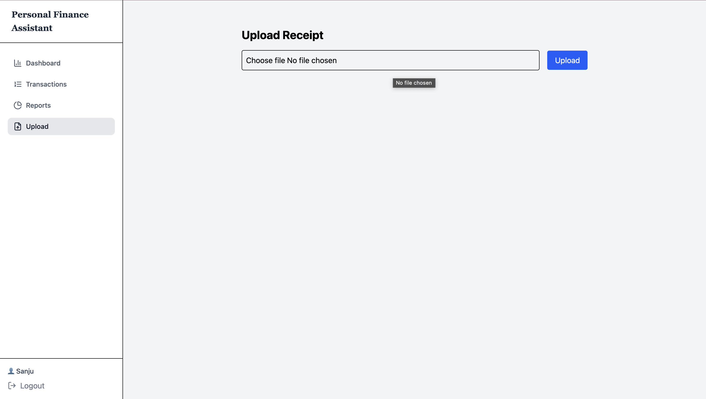

# Personal Finance Assistant (PFA)

The **Personal Finance Assistant** is a full-stack application that helps users **track, manage, and understand their financial activities**.  
Users can log income and expenses, categorize transactions, upload receipts (images/PDFs), and visualize their spending with charts.

This project demonstrates clean architecture, modular code, API-first design, and use of cloud services.

---

## Features

- 🔐 **User Authentication** – JWT-based registration & login with protected routes
- 💰 **Transaction Management** – Add, view, filter, and delete income/expense records
- 📊 **Analytics** – Graphs showing expenses by category and over time
- 🧾 **Receipt OCR** – Upload receipts (PDFs or images) → extract store, date, total, and auto-categorize
- ☁️ **Cloud Storage** – Securely store uploaded receipts in Google Cloud Storage
- 🌍 **Multi-user Support** – Each user sees only their own data
- 📑 **Bonus (Optional)** – Support for PDF transaction history uploads, pagination for transaction listing

---

## Tech Stack

- **Frontend:** React, React Router, Tailwind CSS
- **Backend:** Node.js, Express.js
- **Database:** MongoDB with Mongoose
- **Authentication:** JSON Web Tokens (JWT)
- **OCR & Cloud Services:**
  - **Google Cloud Vision API** – Extracts text from receipts (supports both images and PDFs)
  - **Google Cloud Storage (GCS)** – Stores uploaded receipts before processing

---

## Why Google Cloud Vision & Storage?

- **Vision API**:

  - Extracts text from **images** (JPEG, PNG) and **PDF receipts**.
  - For PDFs, the receipt is first uploaded to **Google Cloud Storage**, since Vision API requires a `gs://` URI for batch PDF processing.
  - Detects multilingual text, making receipt parsing more robust.

- **Google Cloud Storage**:
  - Securely stores uploaded receipts.
  - Acts as an intermediate layer for the Vision API when handling PDFs.
  - Keeps large files off the local server for scalability.

---

## How Receipt Processing Works

1. User uploads a **receipt file** (image or PDF).
2. File is saved locally and uploaded to **Google Cloud Storage** if it’s a PDF.
3. The **Vision API** extracts text:
   - For images → `textDetection()`
   - For PDFs → `batchAnnotateFiles()` with a GCS URI
4. Extracted text is **parsed** (`parseReceiptText`) to identify:
   - **Store name** (first line or keyword)
   - **Date** (via regex patterns: DD/MM/YYYY, YYYY-MM-DD, etc.)
   - **Total amount** (regex + fallback strategies)
5. Parsed data is stored in the **database**, and if a total is found, a **transaction** is automatically created.

---

## API Endpoints

### 🔐 Authentication

- **POST** `/api/auth/register` → Register new user
- **POST** `/api/auth/login` → Login user
- **GET** `/api/auth/profile` → Get logged-in user (requires `Authorization: Bearer <token>`)

### 💰 Transactions

- **POST** `/api/transactions` → Add a new transaction
- **GET** `/api/transactions` → Get all transactions for logged-in user (supports filters & sorting)
- **DELETE** `/api/transactions/:id` → Delete a specific transaction

### 🧾 Receipts

- **POST** `/api/receipts` → Upload & process receipt (image/PDF). Extracts store name, date, and total using Google Vision API and saves as a transaction.
- **GET** `/api/receipts` → Get all uploaded receipts for logged-in user

## Screenshots

### Base Page

### Login Page

### Register Page

### Dashboard Page

### Transactions Page

### Reports Page

### Upload Page

